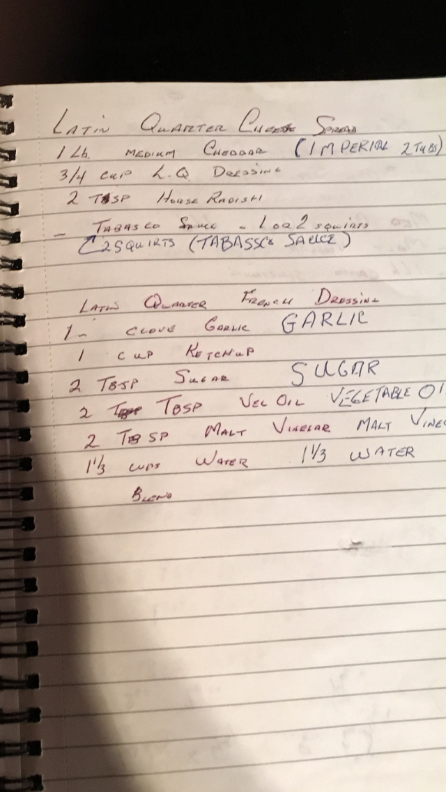

# Latin Quarter Cheese Spread

## Spread
- 1 lb Medium Cheddar (Imperial 2 Tubs - room temp)
- 3/4 Cup Latin Quarter Dressing
- 2 Tbsp Horse Radish
- 2 Squirts Tabasco Sauce
- Process until smooth

## Latin Quarter Dressing
- 1 Clove Garlic
- 1 Cup Ketchup
- 2 Tbsp Sugar
- 2 Tbsp Veg Oil
- 2 Tbsp Malt Vinegar
- 1 1/3 Cups Water
- Blend
