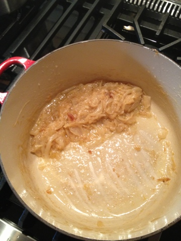

# French Onion Soup

[Michael Smith - French Onion Soup](http://chefmichaelsmith.com/recipe/french-onion-soup/)

## Ingredients
### Carmelized Onions:
* 3 Tbs Butter
* 3 Tbs Veg Oil
* 10 Onions Sliced
* Splash of Water
* Salt

### Soup
* 1/2 Cup Brandy
* Fresh Thyme
* 3 Cups of Chicken Stock
* 3 Cups of Beef Stock (or 6 of 1 kind)
* S & P

## Directions
1. Slice your onions nice and thin and toss 'em in your melted butter and oil (med heat or so).
2. Add a splash of water and salt and cover for about 10 mins on Med High - until the water has evaporated
3. Remove the cover and continue cooking over low heat until your mass of onions looks like this:

4. The pic above took about 80 minutes.  This is not for the weak at heart.
5. Add everything else and simmer for 15 minutes.
6. Ladle up some bowls, top with bread and cheese - broil until brown and melty.

